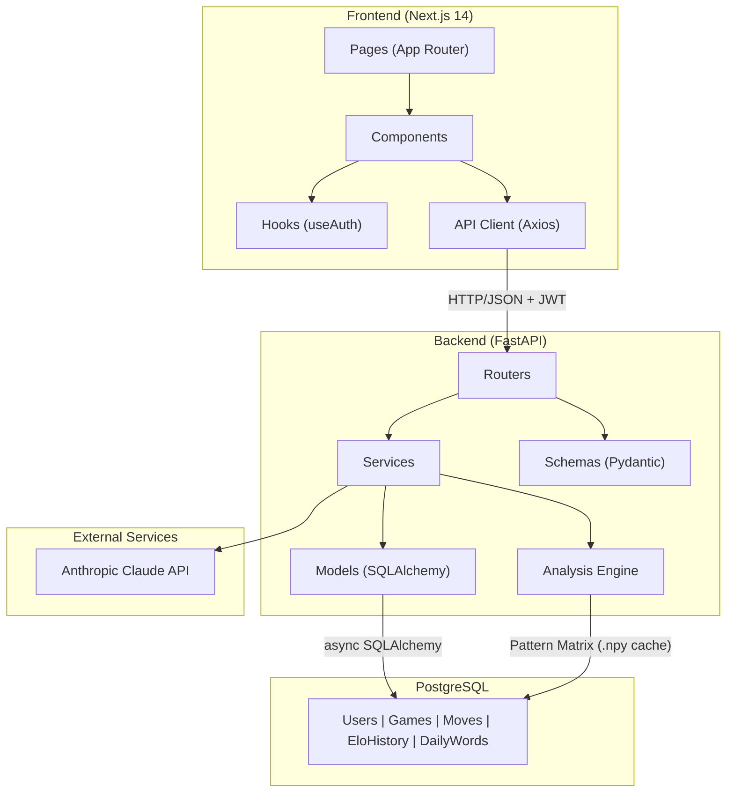
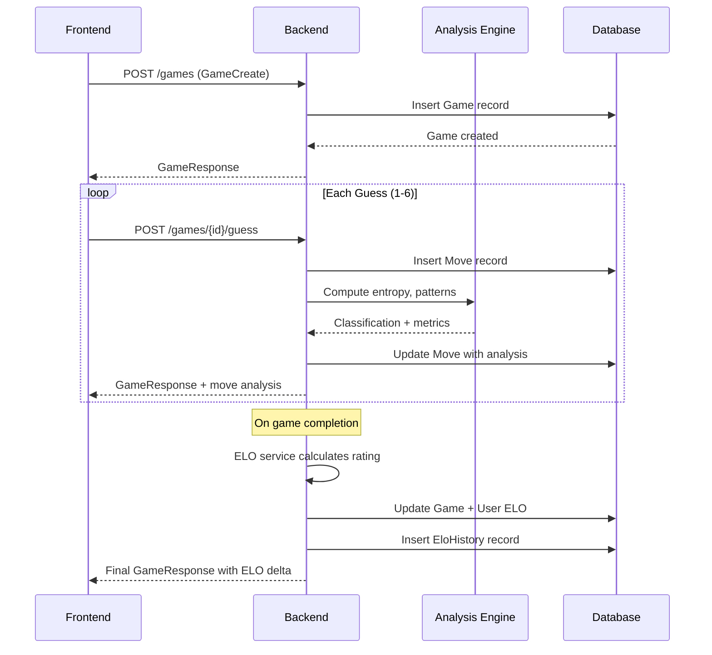
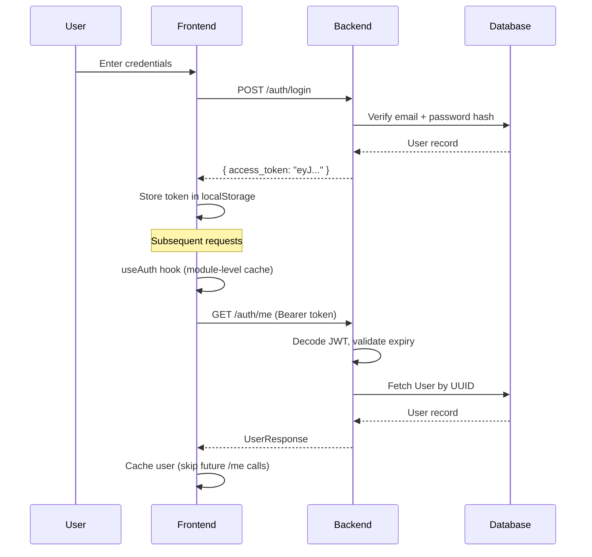
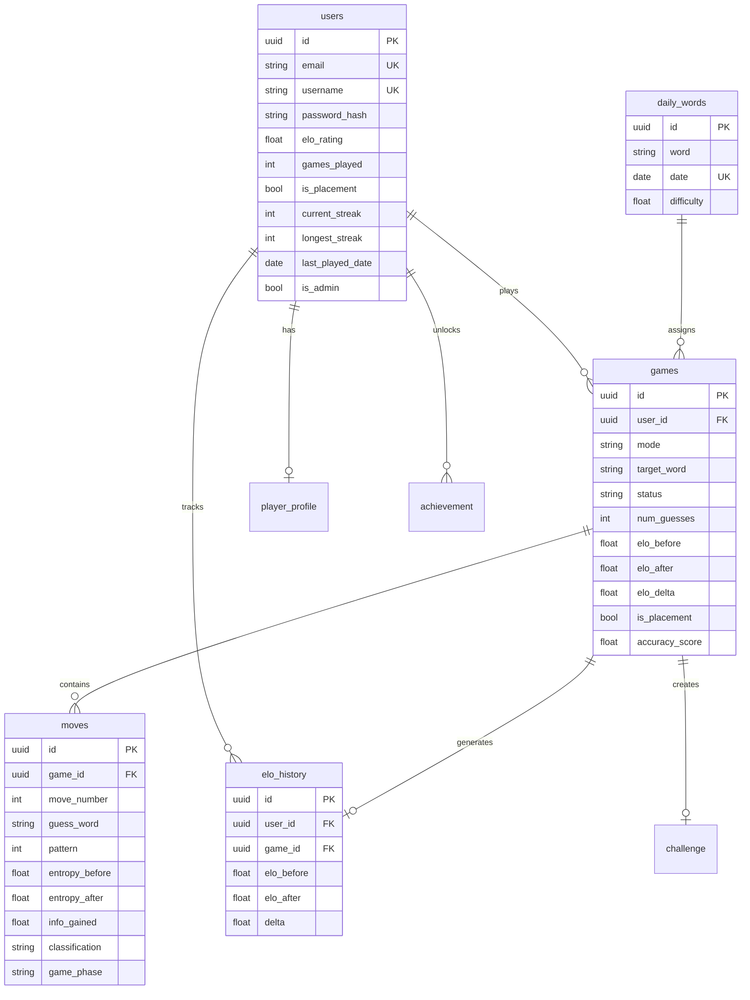
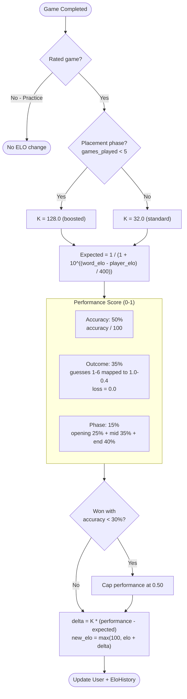
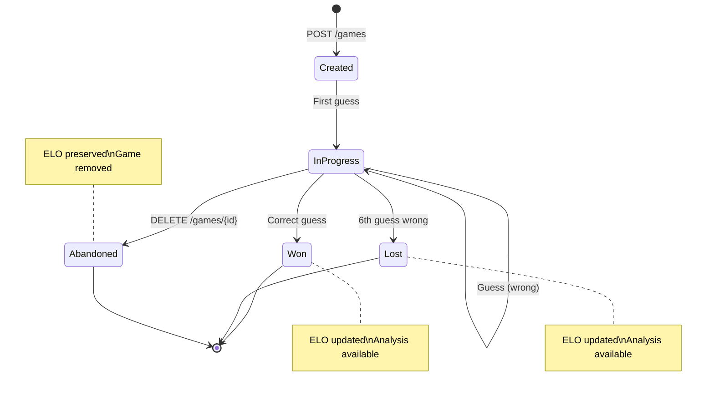
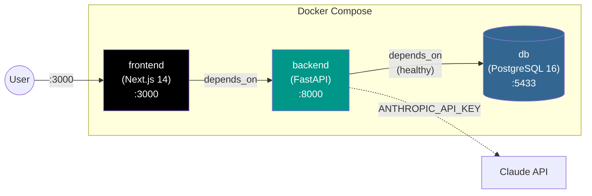

# ELOquence Technical Documentation

## 1. Project Overview

**ELOquence** is a competitive typing game platform built on Wordle mechanics with information-theory analysis and ELO-based ranking. The platform differentiates between traditional Wordle guessing and sophisticated move analysis using information-theoretic concepts like entropy, pattern elimination, and efficiency metrics.

The core value proposition:
- Competitive multiplayer ranking system (ELO-based)
- Deep move analysis with information theory metrics
- Three game modes: daily (global), competitive (ranked), practice (unranked)
- Two word pools: standard (2,309 words) and competitive (~5,500 words)
- AI-powered game summaries and coaching via Claude
- Achievements, challenges, and community leaderboards

## 2. Architecture

### High-Level System Design



### Game Request Flow



**Service Dependencies:**
- PostgreSQL for persistence (async SQLAlchemy ORM)
- FastAPI for HTTP API
- JWT (HS256) for stateless authentication
- Anthropic API for move explanations and game summaries
- Pattern matrix (cached as .npy) for O(1) entropy lookups

## 3. Frontend Architecture

**Technology Stack:** Next.js 14 (App Router), TypeScript, Tailwind CSS, framer-motion

**Directory Structure:**
```
frontend/
├─ app/                        # Next.js App Router pages
│  ├─ page.tsx               # Home / splash page
│  ├─ login/page.tsx         # Login form
│  ├─ register/page.tsx      # Registration form
│  ├─ dashboard/page.tsx     # User dashboard (game history, stats)
│  ├─ play/page.tsx          # Game mode selection (daily/competitive/practice)
│  ├─ game/[id]/page.tsx     # Active game board
│  ├─ review/[id]/page.tsx   # Post-game analysis view
│  ├─ leaderboard/page.tsx   # Global rankings
│  ├─ challenges/[code]/page.tsx  # Challenge mode
│  ├─ achievements/page.tsx   # Achievement display
│  ├─ admin/                  # Admin panel (users, daily words, announcements)
│  └─ layout.tsx             # Root layout with AuthProvider
├─ components/                # Reusable React components
│  ├─ GameBoard.tsx          # Game tiles + keyboard
│  ├─ Tile.tsx               # Individual 5x6 grid tile
│  ├─ Keyboard.tsx           # Wordle keyboard with feedback
│  ├─ GameOverModal.tsx      # Win/loss overlay
│  ├─ Confetti.tsx           # Animation on win
│  ├─ Navigation.tsx         # Top nav with auth
│  ├─ Toast.tsx              # Notifications
│  ├─ GuessDistribution.tsx  # Stats histogram
│  ├─ EloSparkline.tsx       # ELO trend chart
│  ├─ LetterHeatmap.tsx      # Letter frequency heatmap
│  ├─ EntropyWaterfall.tsx   # Entropy visualization
│  ├─ MoveExplanation.tsx    # AI-powered move analysis
│  ├─ CoachChat.tsx          # AI coaching interface
│  ├─ CommunityStats.tsx     # Aggregate game stats
│  └─ graph/                 # Game tree visualization
└─ lib/
   ├─ hooks/useAuth.tsx      # Auth context + caching
   ├─ api.ts                 # Axios client with interceptors
   └─ types.ts               # TypeScript interfaces
```

**Key State Management:**
- **useAuth Hook:** Module-level caching prevents redundant `/auth/me` calls
  - Stores cachedUser and fetchPromise globally
  - Single in-flight request per app lifecycle
  - localStorage token persisted for session recovery
- **Component Local State:** Games, moves managed locally then persisted via API
- **localStorage:** Colorblind mode, reduced motion preferences

**Authentication Flow:**



## 4. Backend Architecture

**Technology Stack:** FastAPI, SQLAlchemy (async), PostgreSQL, Alembic migrations

**Directory Structure:**
```
backend/app/
├─ main.py                    # FastAPI app factory
├─ config.py                  # Settings (env variables)
├─ database.py                # Async SQLAlchemy setup
├─ models/                    # ORM models
│  ├─ user.py                # User (ELO, streaks, admin flag)
│  ├─ game.py                # Game session
│  ├─ move.py                # Individual guess in game
│  ├─ elo_history.py         # ELO change log
│  ├─ daily_word.py          # Daily puzzle assignment
│  ├─ player_profile.py      # Extended user metadata
│  ├─ achievement.py         # Achievement definitions
│  ├─ word_stats.py          # Per-word statistics
│  ├─ ai_cache.py            # Claude response cache
│  ├─ challenge.py           # Challenge codes
│  └─ announcement.py        # Admin announcements
├─ schemas/                   # Pydantic request/response models
│  ├─ user.py                # UserCreate, UserLogin, UserResponse, Token
│  ├─ game.py                # GameCreate, GuessSubmit, GameResponse
│  └─ analysis.py            # AnalysisResponse schemas
├─ routers/                   # API route handlers
│  ├─ auth.py                # Register, login, /me
│  ├─ games.py               # Create, submit guess, list, delete
│  ├─ daily.py               # Daily puzzle endpoints
│  ├─ leaderboard.py         # Global rankings, near-me
│  ├─ users.py               # User stats, ELO history
│  ├─ analysis.py            # Post-game analysis
│  ├─ ai.py                  # Move explanations, summaries, coaching
│  ├─ challenges.py          # Challenge creation and results
│  ├─ achievements.py        # Achievement fetching
│  ├─ graph.py               # Game tree endpoints
│  ├─ admin.py               # User management, daily words, announcements
│  └─ (public) announcements # Public announcement fetch
├─ services/                  # Business logic
│  ├─ auth.py                # Password hashing, JWT, get_current_user
│  ├─ game.py                # Game creation, guess submission, analysis
│  ├─ elo.py                 # ELO calculation and updates
│  ├─ word_difficulty.py     # Word ELO assignment
│  ├─ profile.py             # Player profile operations
│  ├─ achievements.py        # Achievement checking logic
│  ├─ word_stats.py          # Word statistics tracking
│  ├─ ai.py                  # Claude API integration
│  └─ (utilities)
└─ analysis/                  # Information-theoretic analysis
   ├─ engine.py              # Pattern matrix computation
   ├─ classifier.py          # Move classification (brilliant/blunder)
   ├─ constraints.py         # Hard/soft constraint violation detection
   ├─ traps.py               # Trap position detection
   ├─ game_phase.py          # Opening/midgame/endgame classification
   ├─ patterns.py            # Pattern matching logic
   ├─ graph.py               # Game tree construction
   └─ words.py               # Word pool management
```

**Lifespan Management:**
On startup, FastAPI runs:
1. Load word lists (standard 2,309 + competitive ~5,500)
2. Precompute pattern matrix (O(n²), 30-120s on first run, cached as .npy)
3. On subsequent startups, matrix loads instantly from cache

## 5. Database Schema

### Entity Relationship Diagram



### Core Tables

**users**
```
id (UUID, PK)
email (String, unique)
username (String, unique)
password_hash (String)
elo_rating (Float, default 1000.0)
games_played (Integer, default 0)
is_placement (Boolean, default True)  # Changed to False after 5 games
current_streak (Integer, default 0)
longest_streak (Integer, default 0)
last_played_date (Date, nullable)
is_admin (Boolean, default False)
created_at (DateTime)
updated_at (DateTime)
```

**games**
```
id (UUID, PK)
user_id (UUID, FK → users)
mode (String) # daily|competitive|practice
target_word (String)
word_difficulty (Float, nullable)
status (String) # in_progress|won|lost|abandoned
num_guesses (Integer)
time_seconds (Float, nullable)
rated (Boolean, default True)
accuracy_score (Float, nullable)
luck_factor (Float, nullable)
elo_before (Float, nullable)
elo_after (Float, nullable)
elo_delta (Float, nullable)
is_placement (Boolean, default False)
constraint_violations (Integer)
traps_encountered (Integer)
created_at (DateTime)
completed_at (DateTime, nullable)
```

**moves**
```
id (UUID, PK)
game_id (UUID, FK → games)
move_number (Integer)
guess_word (String)
pattern (Integer)  # Ternary encoded: 0=gray, 1=yellow, 2=green
remaining_words (Integer, nullable)
entropy_before (Float, nullable)
entropy_after (Float, nullable)
info_gained (Float, nullable)
optimal_info (Float, nullable)
optimal_word (String, nullable)
expected_remaining (Float, nullable)
optimal_expected_remaining (Float, nullable)
efficiency_ratio (Float, nullable)
bits_lost (Float, nullable)
classification (String, nullable)  # brilliant|best|good|okay|inaccuracy|mistake|blunder|miss|forced
game_phase (String, nullable)  # opening|midgame|endgame
constraint_violation (String, nullable)  # none|hard|soft
trap_detected (Boolean)
is_book_move (Boolean)
created_at (DateTime)
```

**elo_history**
```
id (UUID, PK)
user_id (UUID, FK → users)
game_id (UUID, FK → games, nullable)
elo_before (Float)
elo_after (Float)
delta (Float)
accuracy_score (Float, nullable)
recorded_at (DateTime)
```

**daily_words**
```
id (UUID, PK)
word (String)
date (Date, unique)
difficulty (Float, nullable)
created_at (DateTime)
```

**Other Tables:** player_profile, achievement, word_stats, ai_cache, challenge, announcement

## 6. ELO System

### Rating Calculation Flow



### Mechanism

**Rating Floor:** 100.0

**K-Factor:**
- Placement phase (first 5 games): K = 128.0 (boosted)
- Normal phase: K = 32.0 (standard)
- Flips to False after 5 rated games

**Expected Score Calculation:**
```python
expected = 1.0 / (1.0 + 10.0 ** ((word_elo - player_elo) / 400.0))
```

**Performance Score:** Composite of three components (0-1):
```
performance = 0.50 * accuracy_component
            + 0.35 * outcome_component
            + 0.15 * phase_component
```

- **Accuracy Component:** `accuracy / 100.0`
- **Outcome Component:** Map guesses 1-6 to scores (1=1.0, 6=0.40), 0.0 if lost
- **Phase Component:** Weighted average of opening/midgame/endgame accuracies (0.25/0.35/0.40)
- **Anti-Luck Cap:** If won with accuracy < 30%, performance capped at 0.50

**ELO Delta:**
```python
delta = k * (performance_score - expected)
elo_after = max(100.0, elo_before + delta)
```

**Streak Tracking:** Only for daily games
- Incremented if last_played_date was yesterday
- Reset to 1 if gap > 1 day
- longest_streak updated on completion

## 7. Game Modes

| Feature | Daily | Competitive | Practice |
|---------|-------|-------------|----------|
| **Word Pool** | Standard | Selectable | Selectable |
| **Ranked** | Yes | Yes | No |
| **Frequency** | 1 per day | Any time | Any time |
| **Difficulty Fixed** | Yes | Random | Random |
| **Streaks** | Yes | No | No |
| **ELO Impact** | Yes | Yes | No |
| **Placement K-Factor** | Yes (if in placement) | Yes (if in placement) | N/A |

### Game State Machine



### Word Pools
- **Standard:** 2,309 common English words (NYT Wordle subset)
- **Competitive:** ~5,500 words including less common entries

### Move Classification Scale


Based on bits lost relative to the optimal move. Additional classifications: **forced** (only one valid guess) and **miss** (failed to find the answer when only one remained).

### Analysis
All game modes get full post-game analysis:
- Information-theoretic metrics (entropy, bits lost, efficiency)
- Move classification (brilliant/best/good/okay/inaccuracy/mistake/blunder)
- Game phase classification (opening/midgame/endgame)
- Constraint violations (hard/soft)
- Trap detection

## 8. Authentication & Authorization

### JWT Flow
1. Registration/Login → POST /api/auth/register or /api/auth/login
2. Response: `{ "access_token": "eyJ0eXAi..." }`
3. Client stores in localStorage
4. All protected requests: `Authorization: Bearer <token>`

### Token Details
- **Algorithm:** HS256 (symmetric key)
- **Secret:** `JWT_SECRET` from env (production must override)
- **Expiration:** 7 days from creation (JWT_EXPIRATION_HOURS: 168)
- **Subject Claim (sub):** User UUID string

### Authorization Levels
- **Unauthenticated:** Can view leaderboards, public announcements
- **Authenticated:** Can play games, view own history
- **Admin:** Can manage daily words, view analytics, toggle admin status

### get_current_user Dependency
```python
async def get_current_user(
    credentials: Annotated[HTTPAuthorizationCredentials, Depends(_bearer_scheme)],
    db: Annotated[AsyncSession, Depends(get_db)],
) -> User:
```
- Decodes Bearer token
- Validates JWT signature and expiration
- Queries User from database
- Raises 401 if invalid/expired

## 9. Deployment

### Docker Compose Setup



**Services:**
1. **db (PostgreSQL 16)**
   - Port: 5433:5432
   - Credentials: POSTGRES_USER, POSTGRES_PASSWORD, POSTGRES_DB
   - Healthcheck: pg_isready command
   - Volume: postgres_data

2. **backend (FastAPI)**
   - Port: 8000:8000
   - Depends on: db (healthy)
   - Environment: DATABASE_URL, JWT_SECRET, CORS_ORIGINS, ANTHROPIC_API_KEY
   - Volumes: ./backend, backend_cache (for pattern matrix)
   - Runs Alembic migrations on startup

3. **frontend (Next.js)**
   - Port: 3000:3000
   - Depends on: backend
   - Environment: NEXT_PUBLIC_API_URL (http://localhost:8000)

### Environment Variables

**Backend (.env or docker-compose):**
```
DATABASE_URL=postgresql+asyncpg://eloquence:eloquence_dev@db:5432/eloquence
DATABASE_URL_SYNC=postgresql://eloquence:eloquence_dev@db:5432/eloquence
JWT_SECRET=dev-secret-change-in-production
CORS_ORIGINS=http://localhost:3000
ANTHROPIC_API_KEY=sk-...
```

**Frontend (.env.local):**
```
NEXT_PUBLIC_API_URL=http://localhost:8000
```

### Running Locally
```bash
docker-compose up --build
# Frontend: http://localhost:3000
# Backend: http://localhost:8000
# Database: localhost:5433
```

## 10. API Reference

All endpoints prefixed with `/api` base URL.

### Authentication

**POST /auth/register**
- Request: `{ "email": "...", "username": "...", "password": "..." }`
- Response: `{ "access_token": "..." }` (201)

**POST /auth/login**
- Request: `{ "email": "...", "password": "..." }`
- Response: `{ "access_token": "..." }` (200)

**GET /auth/me** (Protected)
- Response: UserResponse object (200)

### Games

**POST /games** (Protected)
- Request: `{ "mode": "daily|competitive|practice", "word_pool": "standard|competitive" }`
- Response: GameResponse (201)

**GET /games** (Protected)
- Query: `page=1, per_page=20, mode=daily|competitive|practice`
- Response: `{ "games": [...], "total": 147, "page": 1, "per_page": 20 }`

**GET /games/{game_id}** (Protected)
- Response: GameResponse with target_word hidden if in_progress

**POST /games/{game_id}/guess** (Protected)
- Request: `{ "guess": "SALTY" }`
- Response: GameResponse extended with `newly_unlocked: [...]`

**DELETE /games/{game_id}** (Protected)
- Response: GameResponse (200)

**GET /games/{game_id}/community-stats** (Protected)
- Response: Community statistics for word

### Daily

**GET /daily** (Protected)
- Response: `{ "date": "2026-03-18", "word_available": true, "difficulty": 1200.5, "already_played": false, "existing_game_id": null }`

**POST /daily/play** (Protected)
- Response: GameResponse (201 or 200 if already played)

### Leaderboard

**GET /leaderboard** (Public)
- Query: `page=1, per_page=50`
- Response: `{ "rankings": [{"rank": 1, "user": {...}}, ...], "total": 500, "page": 1, "per_page": 50 }`

**GET /leaderboard/near-me** (Protected)
- Response: 5 players above and below current user

### User Stats

**GET /users/me/stats** (Protected)
- Response: Extended user statistics (games, wins, accuracy, etc.)

**GET /users/me/elo-history** (Protected)
- Query: `page=1, per_page=50`
- Response: Paginated EloHistory entries

### Analysis

**POST /analysis/games/{game_id}/analyze** (Protected)
- Response: `{ "accuracy_score": 75.5, "luck_factor": 0.3, "phase_accuracies": {...}, "constraints": {...} }`

### AI Features

**POST /ai/explain-move** (Protected)
- Request: `{ "game_id": "...", "move_number": 1, "context": "..." }`
- Response: Move explanation string (from Claude)

**POST /ai/game-summary/{game_id}** (Protected)
- Response: Game summary string (from Claude)

**POST /ai/coach-chat/{game_id}** (Protected)
- Request: `{ "message": "..." }`
- Response: `{ "response": "..." }`

### Challenges

**POST /challenges/create** (Protected)
- Request: `{ "game_id": "..." }`
- Response: Challenge object with shareable code (201)

**GET /challenges/{code}** (Public)
- Response: Challenge metadata (word, difficulty, etc.)

**POST /challenges/{code}/play** (Protected)
- Response: GameResponse (201)

**GET /challenges/{code}/results** (Public)
- Response: List of attempts on this challenge

### Achievements

**GET /achievements/me** (Protected)
- Response: `{ "unlocked": [...], "progress": {...} }`

**GET /achievements/all** (Public)
- Response: All achievement definitions

### Admin (Protected, requires is_admin=true)

**GET /admin/users**
- Response: Paginated user list

**GET /admin/users/{user_id}**
- Response: User detail

**POST /admin/users/{user_id}/reset-elo**
- Response: `{ "new_elo": 1000.0 }`

**POST /admin/users/{user_id}/toggle-admin**
- Response: UserResponse with updated is_admin

**GET /admin/daily-words**
- Response: List of assigned daily words

**POST /admin/daily-words**
- Request: `{ "date": "2026-03-20", "word": "SALTY", "difficulty": 1200.5 }`
- Response: DailyWord object (201)

**DELETE /admin/daily-words/{target_date}**
- Response: 204 No Content

**GET /admin/announcements** (Public)
- Response: List of active announcements

**POST /admin/announcements** (Protected, admin)
- Request: `{ "title": "...", "content": "...", "expires_at": "..." }`
- Response: Announcement object (201)

**DELETE /admin/announcements/{announcement_id}** (Protected, admin)
- Response: 204 No Content

### Graph

**POST /graph/games/{game_id}/build** (Protected)
- Response: Game tree structure with nodes and edges

**POST /graph/explore** (Protected)
- Request: `{ "game_id": "...", "move_number": 3 }`
- Response: Explored paths from decision point

## Summary

ELOquence is a well-architected competitive Wordle platform combining traditional game mechanics with sophisticated information-theoretic analysis. The frontend-backend separation is clean, authentication is stateless (JWT), and the database schema supports comprehensive game history tracking and ELO calculation. The modular backend services make it easy to extend with new analysis features, AI integrations, and competitive features. Deployment via Docker Compose ensures consistency across environments.
